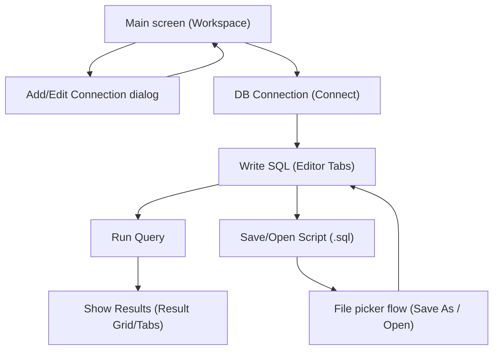

## 1. Product Overview
QueryPlus is a desktop application (Tauri + React) for managing database connections and running SQL, similar to TablePlus.
The app focuses on UX: a connection sidebar, tab-based SQL editor, and a fast result grid.

## 2. Core Features

### 2.1 Feature Modules
QueryPlus includes the following main screens/flows:
1. **Main screen (Workspace)**: manage connections (sidebar), browse DB schema, tabbed SQL editor, run queries and view results.
2. **Add/Edit Connection dialog**: enter connection info, auto-fill port by DB type, test connection, persist config.
3. **File picker flow (Save As / Open)**: choose where to save/open `.sql` files via a native dialog.

### 2.3 Page Details
| Page Name | Module Name | Feature description |
|-----------|-------------|---------------------|
| Main screen (Workspace) | App Shell 3-panel | 3-panel layout: Sidebar (connections + schema + scripts), Editor/Toolbar area, Results/Status bar area. |
| Main screen (Workspace) | Connection Sidebar | List connections (icon by DB type), connected/disconnected state, connect/disconnect actions, open modal to create a new connection. |
| Main screen (Workspace) | Schema Browser | Browse databases/tables/columns; click a table to insert `SELECT * ... LIMIT 100` into the editor. |
| Main screen (Workspace) | SQL Editor Tabs | Create/rename/close tabs; each tab is tied to connection + database; show saved/unsaved state. |
| Main screen (Workspace) | SQL Editor (CodeMirror) | SQL editing with highlighting, line numbers, bracket matching, keyword autocomplete; run selection or statement at cursor. |
| Main screen (Workspace) | Keyboard Shortcuts | `Ctrl+Enter` (run selection/statement), `Ctrl+Shift+E` (run all), `Ctrl+S` (save). |
| Main screen (Workspace) | Toolbar | Select database (dropdown), Run/Run All/Save buttons, primary actions in a TablePlus-like style. |
| Main screen (Workspace) | Query Execution + Auto-reconnect | Execute queries via backend; if the query fails due to lost connection, auto-reconnect and retry up to **3 times** (with backoff) before returning an error. |
| Main screen (Workspace) | Result Grid | Display results in a grid (virtual scrolling), row numbers, copy cell, resize columns, render `NULL` as grey/italic, show row count + execution time. |
| Main screen (Workspace) | Result Summary | In addition to the returned row count, show **Total records** (total rows in DB) for eligible `SELECT` cases. |
| Main screen (Workspace) | Pagination | If a query uses pagination (LIMIT/OFFSET or equivalent), the result table shows pagination controls (page, page size) and allows quick page navigation. |
| Main screen (Workspace) | Result Grid (Create/Edit/Delete) | For editable `SELECT` results: allow inline cell edits, multi-row selection, **add a new row**, delete rows (single/multi), and show “dirty changes”. Always show a **Save** button below the table to apply changes (with confirmation). |
| Main screen (Workspace) | Result Tabs | Show multiple result sets per run (if multiple queries/statements are executed). |
| Main screen (Workspace) | Status Indicators | Green/red dot indicates connection state; click to reconnect when disconnected. |
| Main screen (Workspace) | Script List | List `.sql` files per connection; create scripts; rename/delete; open files in a tab. |
| Add/Edit Connection dialog | Connection Form | Enter DB type, name, host, port (auto-filled by DB type), username, password, database, SSL toggle. |
| Add/Edit Connection dialog | Test Connection | Call test connection command and show success/failure message. |
| Add/Edit Connection dialog | Persist Config | CRUD connections and persist to a local config file so they survive app restarts. |
| File picker flow (Save As / Open) | Native File Dialog | Open the OS dialog to choose a path for saving/opening `.sql`; update current tab with filePath + isSaved state. |

## 3. Core Process
**Connection management flow**
1) From Workspace, click “New Connection” to open the modal.
2) Choose DB type (Postgres/MySQL/MariaDB), enter fields, click “Test Connection”.
3) If test succeeds, click “Save” to persist the connection.
4) In the Sidebar, click “Connect” to establish the connection; status becomes Connected.

**Edit & run query flow (with auto-reconnect)**
1) Open a new query tab or open a `.sql` file from Script List.
2) Select the database in the Toolbar (dropdown).
3) Press `Ctrl+Enter` to run selection/statement, or `Ctrl+Shift+E` to run all.
4) Backend executes the query; if a connection loss is detected:
   - Auto-reconnect and retry up to **3 times** (with backoff).
   - If it still fails after 3 retries, return a clear error to the UI.
5) UI shows the Result Grid with execution time and row count.
6) For `SELECT` results:
   - Show `Rows returned` (rows in the current result set).
   - If available, show `Total records`.
   - If the query is paginated, show pagination controls and allow changing page/page size.

**Inline create/update/delete on the result table (SELECT → Create/Edit/Delete → Save)**
1) Run a `SELECT` and display the results as a grid.
2) If the result is eligible for editing (e.g., single-table query with a primary key), enable edit mode:
   - Edit: double click a cell → edit inline; cell/row becomes “dirty”.
   - Create: click “Add row” to create a new row (top or bottom), then fill column values.
   - Delete: select one or multiple rows → click Delete (or context action) to mark “pending delete”.
3) The **Save** button is always shown under the table:
   - No changes: Save is disabled.
   - With changes: Save is enabled and shows change counts (edited/deleted).
4) Click Save → show a confirmation (summary of rows to update/delete). If confirmed:
   - Backend runs `INSERT`/`UPDATE`/`DELETE` statements (single or batch) based on your interactions.
   - Run inside a transaction; if connection is lost, auto-reconnect and retry up to **3 times**.
5) On successful Save:
   - UI clears dirty state.
   - Re-run the `SELECT` to refresh the grid (or use optimistic updates when feasible).
6) If not eligible (complex query/join/no PK): the grid is read-only and Save is hidden/disabled.

**Script management flow**
1) Press `Ctrl+S` to save the file; the first time it opens “Save As”.
2) The `.sql` file is stored under the connection’s scripts directory.
3) You can reopen from Script List, rename/delete, and open in a tab.

