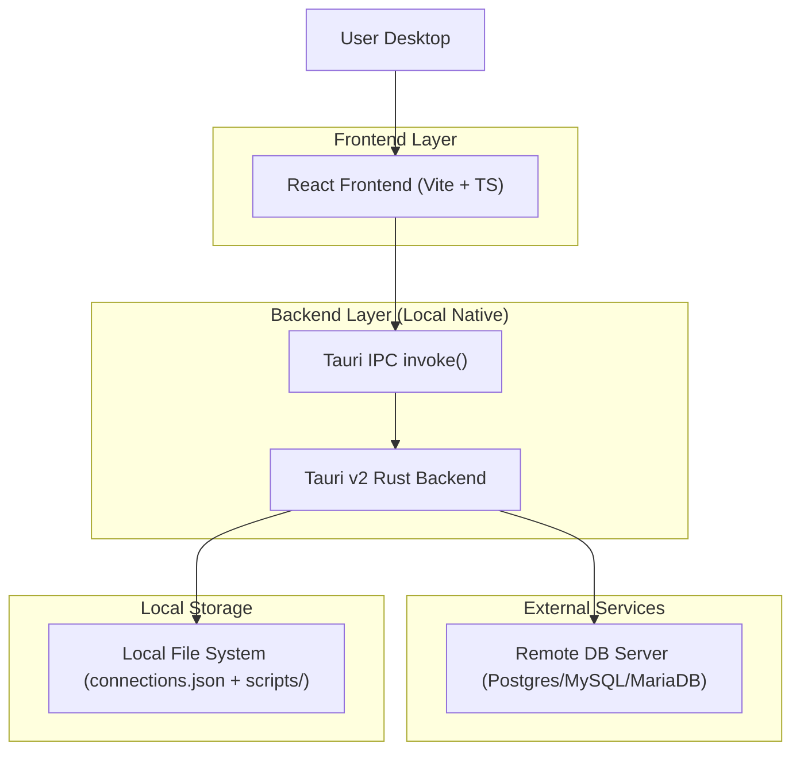
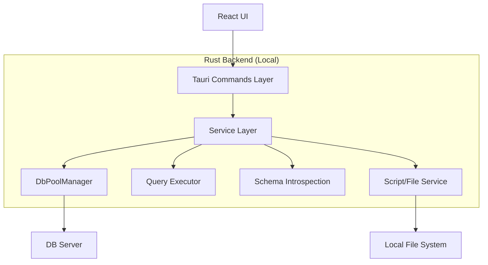
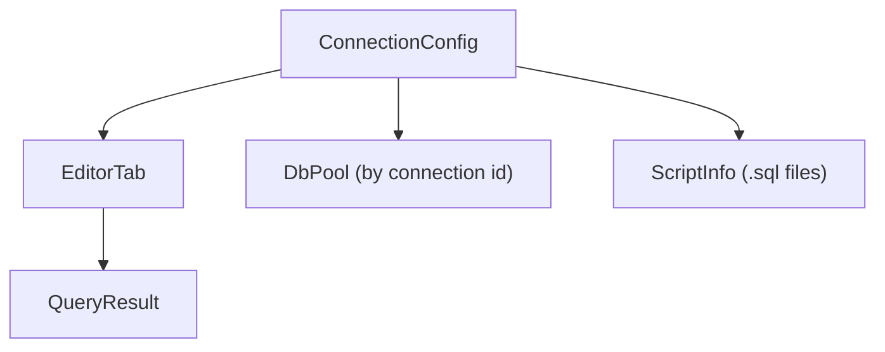

## 1.Architecture design


## 2.Technology Description
- Frontend: React@18 + TypeScript + Vite + TailwindCSS + Zustand
- Editor: CodeMirror 6 (uiw/react-codemirror + lang-sql)
- Desktop/Backend: Tauri v2 (Rust) + Tokio
- DB Drivers (backend): sqlx (Any) + tauri-plugin-sql (enable postgres/mysql features theo plan)
- Native dialog: tauri-plugin-dialog

## 3.Route definitions
| Route | Purpose |
|-------|---------|
| / | Workspace: sidebar connections/schema/scripts + editor + results + status bar |

## 4.API definitions (If it includes backend services)
Các “API” là Tauri commands (frontend gọi qua `invoke`).

### 4.1 Shared TypeScript types (FE dùng trực tiếp; BE serialize JSON)
```ts
export type DbType = 'postgres' | 'mysql' | 'mariadb';

export interface ConnectionConfig {
  id: string;
  name: string;
  db_type: DbType;
  host: string;
  port: number;
  username: string;
  password: string;
  database: string;
  ssl: boolean;
  created_at: string;
  updated_at: string;
}

export interface ColumnInfo {
  name: string;
  data_type: string;
}

export interface EditableResultInfo {
  enabled: boolean;
  reason_disabled?: string;
  database: string;
  schema?: string;
  table?: string;
  primary_key_columns?: string[];
}

export type JsonValue = null | boolean | number | string | JsonValue[] | { [k: string]: JsonValue };

export type RowKey = JsonValue[];

export interface RowUpdate {
  key: RowKey;
  set: Record<string, JsonValue>;
}

export interface RowDelete {
  key: RowKey;
}

export interface RowInsert {
  values: Record<string, JsonValue>;
}

export interface ApplyChangesInput {
  connection_id: string;
  database: string;
  schema?: string;
  table: string;
  primary_key_columns: string[];
  inserts: RowInsert[];
  updates: RowUpdate[];
  deletes: RowDelete[];
}

export interface ApplyChangesResult {
  inserted_count: number;
  updated_count: number;
  deleted_count: number;
}

export interface QueryResult {
  columns: ColumnInfo[];
  rows: JsonValue[][]; // serde_json::Value[][]
  row_count: number;
  execution_time_ms: number;
  editable?: EditableResultInfo;
  pagination?: {
    limit?: number;
    offset?: number;
    page?: number;
    page_size?: number;
  };
  total_records?: number;
}

export interface ScriptInfo {
  path: string;
  name: string;
  updated_at?: string;
}
```

### 4.2 Connection commands
- `list_connections() -> ConnectionConfig[]`
- `create_connection(...) -> ConnectionConfig`
- `save_connections(connections: ConnectionConfig[]) -> void`
- `load_connections() -> ConnectionConfig[]`
- `test_connection(...) -> Result<string, string>`
- `db_connect(config: ConnectionConfig) -> Result<string, string>`
- `db_disconnect(id: string) -> Result<void, string>`

### 4.3 Query commands
- `execute_query(connection_id: string, query: string) -> Result<QueryResult, string>`
  - Nội bộ dùng `execute_with_reconnect(...)`.
  - Với `SELECT` phù hợp, backend cố gắng trả thêm:
    - `total_records`: tổng record trong DB/tập dữ liệu.
    - `pagination`: thông tin LIMIT/OFFSET (nếu có thể suy ra an toàn).
- `apply_changes(input: ApplyChangesInput) -> Result<ApplyChangesResult, string>`
  - Chạy batch `INSERT`/`UPDATE`/`DELETE` trong 1 transaction.
  - Chỉ bật khi có đủ thông tin table + PK.
  - Nội bộ dùng cùng policy `execute_with_reconnect(...)` (retry tối đa 3 lần).

### 4.4 Schema commands
- `list_databases(connection_id: string) -> Result<string[], string>`
- `list_tables(connection_id: string, database: string) -> Result<string[], string>`
- `list_columns(connection_id: string, database: string, table: string) -> Result<ColumnInfo[], string>`
- `get_primary_key(connection_id: string, database: string, table: string) -> Result<string[], string>`

### 4.5 Script commands
- `save_script(path: string, content: string) -> Result<void, string>`
- `load_script(path: string) -> Result<string, string>`
- `list_scripts(dir: string) -> Result<ScriptInfo[], string>`

## 5.Server architecture diagram (If it includes backend services)


## 6.Data model(if applicable)
### 6.1 Data model definition
Các dữ liệu chính của QueryPlus (phục vụ UI và persist local):
- ConnectionConfig: cấu hình kết nối (persist)
- Active Connection State: trạng thái connected/disconnected + pool id
- EditorTab: nội dung tab, connectionId, database, filePath, isSaved
- QueryResult: columns, rows, row_count, execution_time_ms
- ResultGridEditState: trạng thái edit/delete trên result table (dirty cells, selected rows)
- ChangeSet: tập hợp update/delete sẽ gửi xuống backend khi bấm Save
- ScriptInfo: metadata file `.sql`

Sơ đồ quan hệ logic:


### 6.2 Auto-reconnect retry policy (bắt buộc)
**Mục tiêu:** Khi query thất bại do mất kết nối, tự khôi phục mà không bắt bạn thao tác lại.
- Điều kiện kích hoạt: lỗi thuộc nhóm connection/closed/terminate hoặc IO error (theo `is_connection_error`).
- Chiến lược: reconnect + retry lại cùng query (áp dụng cho cả `SELECT` và thao tác Save batch `UPDATE/DELETE`).
- Giới hạn: tối đa **3 lần retry**.
- Backoff: exponential (ví dụ 250ms, 500ms, 1000ms) để tránh loop dày.
- Hành vi UI: hiển thị “Reconnecting… (n/3)” khi đang retry; nếu hết 3 lần thì trả lỗi cuối cùng.

Gợi ý pseudo-flow:
1) Thử chạy query lần 1.
2) Nếu OK → trả kết quả.
3) Nếu lỗi connection → for attempt=1..3: reconnect, delay(backoff), retry query.
4) Nếu vẫn lỗi → trả error “Query failed after 3 reconnect attempts”.
